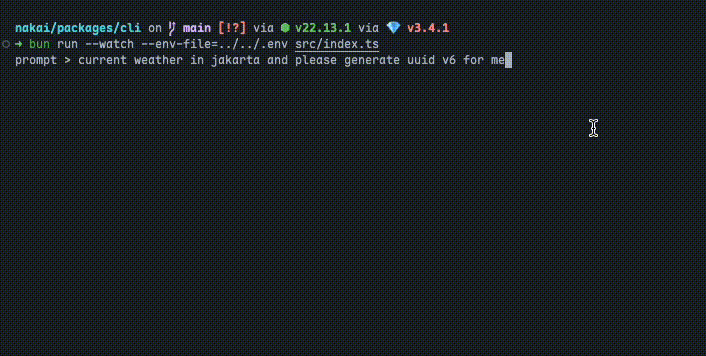
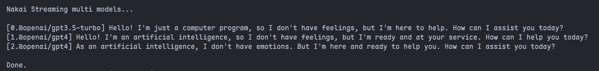

# Nakka
Multi AI SDK built on top of Langchain, designed for seamless integration into projects with modular workflows and extensions.  


## Main Features
- 📚 Unified Model Providers with Langchain
- 🤖 Multi-Model Streaming Chat Conversations
- 📖 Multi Branch Chat
- 📦 Modular Workflow with Extensions
- 🛎️ Event-Driven Stream Data
- 🌐 Browser Support

## Packages
- `@nakka/core`: Nakka core functionalities
- `@nakka/kit`: Extension kit
- `@nakka/extension`: Official extensions
- `@nakka/ui`: UI SDK
- `@nakka/cli`: Example usage Nakka with command line interface


## Concept
### Chat Input
ChatConversation Input:
```json
{
  "prompt": "Generate UUID, and get weather in jakarta today",
  "models": [
    "@openai/gpt3.5-turbo",
    ["@openai/gpt4", { "temperature": 0.5 }],
    [
      "@openai/gpt4",
      { "temperature": 0.5, "maxTokens": 100 },
      {
        "extensions": [
          "@official/weather",
          ["@official/uuid-generator", { "version": "v6" }
        ]
      }
    ]
  ]
}
```
The concept is to ensure that the input has the freedom to choose the model, the extensions used, and the necessary custom parameters, allowing for the construction of more complex workflows. It also allows for multiple models to be run simultaneously to create a more dynamic chat conversation.


## Usage
### Streaming Multiple Models
1. Install nakka
```bash
bun install @nakka/core
```

2. Create a nakka instance
```typescript
import readline from 'readline'
import {
  NakkaCore,
  OpenaiGpt3dot5TurboModel,
  OpenaiGpt4Model,
} from '@nakka/core'

const nakka = new NakkaCore({
  models: [
    OpenaiGpt3dot5TurboModel,
    OpenaiGpt4Model,
  ],
  env: {
    MODEL_OPENAI_API_KEY: process.env.MODEL_OPENAI_API_KEY || '',
  }
})

const conversation = nakka.chat({
  models: [
    '@openai/gpt4',
    '@openai/gpt3.5-turbo',
    ['@openai/gpt3.5-turbo', { temperature: 0.5 }],
  ], // multiple models 
  prompt: 'Hello, how are you?',
})

const modelOutputs: Record<string, string> = {};
conversation.models.forEach((model, index) => {
  const key = `${index}.${model.metadata.id}`
  modelOutputs[key] = ""
})
const updateCLI = () => {
  readline.cursorTo(process.stdout, 0, 0);
  readline.clearScreenDown(process.stdout);
  console.log("nakka Streaming Multiple Models...\n")
  Object.entries(modelOutputs).forEach(([key, output]) => console.log(`[${key}] ${output}`))
}

// Stream output
console.log(`Stream:`);
const stream = conversation.stream();
for await (const chunk of stream) {
  if (chunk.type === 'content' && chunk.content) {
    const key = `${chunk.modelIndex}.${chunk.modelId}`
    modelOutputs[key] = (modelOutputs[key] || '') + chunk.content
    updateCLI()
  }
}
console.log(`\nDone.`)
```
3. Multi Output



### Create Custom "Tool" with Nakka Extension Kit
1. Example Extension: Generate UUID
```typescript
import { defineNakkaExtension } from '@nakka/kit'

const extUuidGenreator = defineNakkaExtension({
  id: '@official/uuid-generator',
  name: 'UUID Generator Tool',
  description: 'Generate UUID realtime',
  tags: ['tools', 'generator'],
  schema: z.object({
    version: z.enum(['auto', 'v4', 'v6', 'v7']).default('auto'),
  }),
  setup(context) {
    context.addTool(
      'uuid-generator',
      `use this tool if user want to generate uuid`,
      z.object({
        version: z.enum(['v4', 'v6', 'v7']).default('v4'),
      }),
      async (params, input) => {
        const version = params.version == 'auto' ? input.version : params.version
        if (version === 'v6') return uuid.v6()
        if (version === 'v7') return uuid.v7()
        return uuid.v4()
      }
    )
  },
})
```
2. Examlpe Usage: Weathers
```typescript
import { defineNakkaExtension } from '@nakka/kit'

const extWeather = defineNakkaExtension({
  id: '@official/weather',
  name: 'Realtiem Weather',
  description: 'Get realtime weather',
  tags: ['tools'],
  schema: z.object({}),
  setup(context) {
    context.addTool(
      'weather',
      `use this tool if user want to get realtime weather`,
      z.object({
        location: z.string().default('jakarta'),
      }),
      async (extsParams, params) => {
        return `Weather in ${params.location} is sunny`
      }
    )
  },
})
```
3. Use Extension
```typescript
import { NakkaCore, OpenaiGpt3dot5TurboModel } from '@nakka/core'

const nakka = new NakkaCore({
  models: [
    OpenaiGpt3dot5TurboModel,
  ],
  env: {
    MODEL_OPENAI_API_KEY: process.env.MODEL_OPENAI_API_KEY || '',
  }
})

const conversation = nakka.chat({
  models: [
    // using model id
    '@openai/gpt3.5-turbo',
    // model id with params
    ['@openai/gpt3.5-turbo', { temperature: 0.5 }],
    // with extensions
    [
      '@openai/gpt3.5-turbo',
      { temperature: 1, maxTokens: 100 },
      {
        extensions: [
          '@official/uuid-generator',
          '@official/weather',
        ],
      },
    ]
  ],
  prompt: 'Generate UUID, and get weather in jakarta today',
})
```